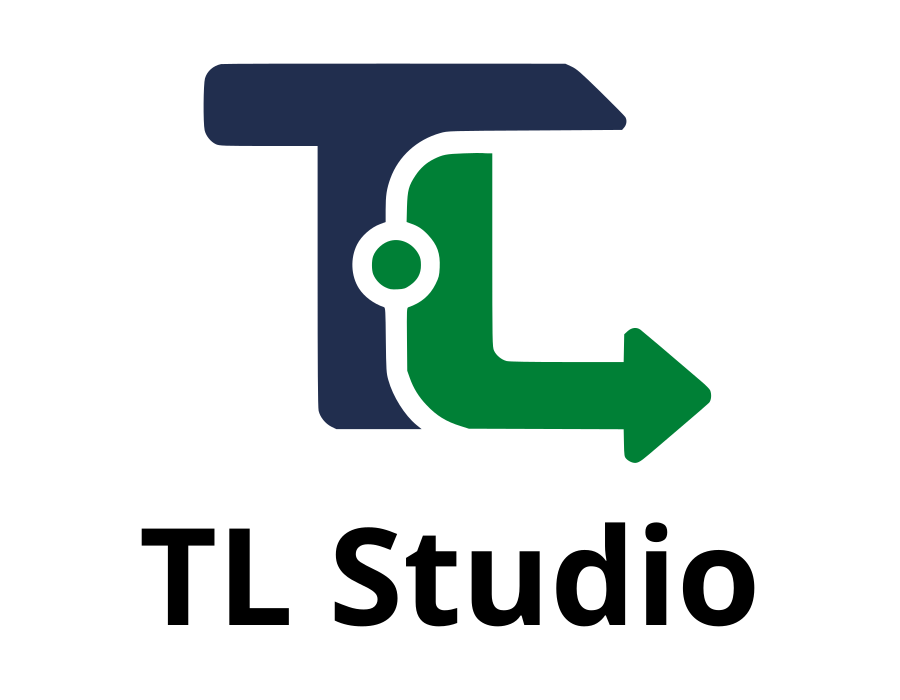

[English](./README.md) | [فارسی](./README.fa_IR.md)

<p align="center">
  
</p>

<h1 align="center">TL Studio</h1>

<p align="center">
  یک محیط توسعه‌ی سریع و لوکال با AI داخلی.
</p>

<p align="center">
  <a href="https://github.com/pouramin/TL-Studio/releases"></a>
  <a href="https://github.com/pouramin/TL-Studio/actions/workflows/ci.yml"></a>
  <a href="https://www.npmjs.com/package/tl-studio"></a>
  <a href="https://github.com/pouramin/TL-Studio/releases"></a>
  <a href="./LICENSE"></a>
</p>

**TL Studio** یک محیط توسعه‌ی لوکال در مرورگر است که هم خودتان می‌توانید داخلش کد را بخوانید و ویرایش کنید و هم در کنار آن از Agent کمک بگیرید. Project را باز کنید، فایل‌ها را مدیریت و ویرایش کنید، در کل کد جست‌وجو کنید، Command اجرا کنید، Preview بگیرید، Model و Provider انتخاب کنید و هرجا خواستید کار را به Agent بسپارید.

برای استفاده‌ی معمول نیازی به VS Code، JetBrains، Cursor، Docker، Backend ابری TL Studio یا Database جداگانه نیست.

## شروع سریع

### اجرا با یک دستور

اگر Node.js و npm نصب هستند، داخل فولدر پروژه‌ای که می‌خواهید روی آن کار کنید این دستور را اجرا کنید:

```bash
npx --yes tl-studio
```

پکیج npm فقط یک Launcher سبک است. سیستم‌عامل و معماری را تشخیص می‌دهد، Release رسمی و متناظر TL Studio را از GitHub دانلود می‌کند، SHA-256 آن را بررسی می‌کند، فایل را به‌صورت محلی Cache می‌کند و TL Studio را با فولدر فعلی به‌عنوان Project باز می‌کند.

برای جلوگیری از بازشدن خودکار مرورگر:

```bash
npx --yes tl-studio --no-browser
```

نسخه‌های آزمایشی همچنان می‌توانند با Channel مشخص اجرا شوند، برای مثال:

```bash
npx --yes tl-studio@alpha
```

### نسخه‌ی Portable

برای نسخه‌ی Portable نیازی به Node.js نیست. فایل مناسب سیستم خود را از **[GitHub Releases](https://github.com/pouramin/TL-Studio/releases)** دانلود و Extract کنید، سپس اجرا کنید:

```text
Windows:  tl-studio.exe
Linux:    ./tl-studio
macOS:    ./tl-studio
```

Runtime لوکال سازگار از قبل داخل Release قرار دارد.

## قابلیت‌ها

- **محیط توسعه‌ی مستقل و لوکال** — Editor، File Explorer، Search، Terminal، Preview و Agent در یک Workspace مرورگری.
- **انتخاب مستقیم Project** — بازکردن فولدر با Folder Picker خود سیستم‌عامل.
- **انتخاب Agent و Model** — تغییر Agent و مدل‌های Providerها از داخل Composer.
- **Custom Provider** — اتصال Endpointهای سازگار با OpenAI، OpenAI Responses و Anthropic با Credential خود کاربر.
- **File attachment** — ارسال تصویر، PDF و فایل‌های متنی/کد؛ همراه با Multi-select، Drag & Drop و Paste از Clipboard.
- **نمایش زنده‌ی فعالیت Agent** — نمایش Reasoning و Toolها همراه با وضعیت Run.
- **Permission و Question** — Allow یک‌باره، ذخیره‌ی Ruleهای قابل‌تکرار در صورت پشتیبانی، Reject و پاسخ به سؤال‌های تعاملی.
- **Stop و Recovery** — توقف Run فعال و بازیابی Sessionهای گیرکرده یا خطاهای Retryable.
- **مدیریت Session** — ساخت، ادامه، تغییر نام، حذف و جابه‌جایی Sessionها بین Projectهای اخیر.
- **Project Usage** — نمایش مصرف هر Turn و مجموع Project شامل Token، Request، Time، Reasoning و Cache.
- **Changes panel** — مشاهده‌ی فایل‌های تغییرکرده، تعداد خطوط اضافه/حذف‌شده و Patch.
- **Project Workspace داخلی** — File Explorer قابل‌نوشتن، Editor چندتب، Save/Create/Rename/Delete و هماهنگی با تغییرات خارجی فایل.
- **Project Search** — جست‌وجوی سریع متن در کل Project با Include/Exclude و بازکردن مستقیم نتیجه در Editor.
- **Terminal داخلی** — اجرای Command در Scope پروژه، تاریخچه‌ی خروجی، Stop و پایان Process tree.
- **Live Preview** — Preview لوکال برای Static یا Node dev server در پنجره‌ی قابل‌جابجایی و تغییر اندازه.
- **تنظیمات ظاهر و Editor** — حالت System، Dark و Light به‌همراه Editor theme و Font جداگانه برای UI، Code و Terminal.
- **معماری Local-first** — اجرای Loopback-only، رمز تصادفی Backend در هر اجرا، کنترل Origin و CSP محدودکننده.
- **بدون Cloud یا Telemetry اختصاصی TL Studio** — ترافیک Model براساس Provider و Runtime انتخاب‌شده‌ی کاربر انجام می‌شود و از زیرساخت TL Studio عبور نمی‌کند.

## معماری

```text
Browser workspace
    │ فقط localhost
    ▼
TL Studio launcher (Go)
    │
    ├─ TL Studio provider/model registry
    ├─ project files / search / terminal / preview
    │
    └─ runtime adapter محلی و احراز‌شده
            ▼
        Local agent runtime
            ├─ agents / sessions / tools
            ├─ permissions / questions / live events
            └─ provider execution / model inference
```

TL Studio مالک لایه‌ی محصول است: Workspace، رابط کاربری، Launcher محلی، تعریف Provider و Model، تجربه‌ی Project و Session، Recovery و Release packaging.

تعریف Custom Providerها داخل State محلی خود TL Studio ذخیره می‌شود و Launcher آن‌ها را برای Runtime فعال ترجمه می‌کند. Credentialها فعلاً به Credential Store محلی Runtime سپرده می‌شوند و داخل Provider Registry خود TL Studio ذخیره نمی‌شوند.

Runtime به‌عنوان یک لایه‌ی زیرساختی جدا پشت این مرز قرار می‌گیرد.

Project انتخاب‌شده روی سیستم کاربر باقی می‌ماند و TL Studio ترافیک Model را از زیرساخت خودش عبور نمی‌دهد.

## مرز Runtime

مرورگر و رابط محصول TL Studio به قراردادهای خود TL Studio وابسته‌اند، نه به API اختصاصی یک Engine. ترافیک Runtime مرورگر فقط از مرز محلی `/runtime/*` عبور می‌کند و تعریف Provider/Model، فایل‌های Project، Search، Terminal، Preview و بخش‌های اصلی Workspace در مالکیت TL Studio هستند.

نسخه‌ی Stable فعلی، **Kilo Code 7.6.2** را به‌عنوان Agent Engine شخص ثالث و تست‌شده Bundle می‌کند. این Engine یک جزئیات پیاده‌سازی پشت Runtime Adapter است و هویت عمومی محصول به آن وابسته نیست. جزئیات سازگاری Engine در [`docs/KILO_API_CONTRACT.md`](./docs/KILO_API_CONTRACT.md) و Attribution لازم در [`THIRD_PARTY_NOTICES.md`](./THIRD_PARTY_NOTICES.md) نگهداری می‌شود.

CI همین Engine پین‌شده را از طریق مرز عمومی Runtime خود TL Studio برای Project routing، APIهای Agent/Provider/Session، Async Prompt، Live events، Permission، Provider configuration، اجرای Tool و Write واقعی روی فایل تست می‌کند.

## نسخه‌های قابل دانلود

| سیستم‌عامل | معماری |
| --- | --- |
| Windows | x64 |
| Linux | x64، ARM64 |
| macOS | Intel x64، Apple Silicon ARM64 |

## ساختار فایل Release

```text
tl-studio/
├─ tl-studio[.exe]
├─ bin/
│  └─ kilo[.exe]
├─ LICENSE
├─ THIRD_PARTY_NOTICES.md
└─ third_party/
   └─ KILO_LICENSE.txt
```

## اجرا از سورس

نیازمندی‌های Development:

- Go 1.23 یا جدیدتر
- Runtime binary سازگار در `PATH`، کنار Launcher یا مشخص‌شده به‌صورت دستی

```bash
go run ./cmd/launcher
```

بازکردن یک Project مشخص:

```bash
go run ./cmd/launcher --project /path/to/project
```

استفاده از Runtime binary مشخص:

```bash
go run ./cmd/launcher --runtime-bin /path/to/runtime
```

برای جلوگیری از بازشدن خودکار مرورگر از `--no-browser` استفاده کنید.

## قانون زیرساخت صفر

TL Studio طوری طراحی شده که نگهدارنده برای اجرای پروژه نیازی به پرداخت هزینه‌ی VPS، Hosting، Database، API Gateway، Model inference یا Telemetry backend نداشته باشد. سورس، Issueها، CI، Releaseها، فایل‌های دانلودی و Launcher سبک npm از زیرساخت GitHub/npm توزیع می‌شوند.

هزینه‌ی احتمالی استفاده از Model مستقیماً بین کاربر و Provider انتخاب‌شده‌ی اوست.

## مدل امنیتی

Launcher:

1. رابط را فقط روی Loopback اجرا می‌کند؛
2. Runtime لوکال را با رمز تصادفی در هر اجرا بالا می‌آورد؛
3. رمز Backend را سمت Server نگه می‌دارد؛
4. Project انتخاب‌شده را فقط به‌صورت محلی Route می‌کند؛
5. درخواست‌های Cross-origin را رد می‌کند؛
6. و رابط را با Content Security Policy محدودکننده سرو می‌کند.

Runtime در صورت داشتن Permission می‌تواند فایل‌ها را بخواند، بنویسد و Command اجرا کند. TL Studio را فقط روی سیستم و Projectهایی اجرا کنید که به آن‌ها اعتماد دارید.

## وضعیت پروژه

TL Studio خط پایدار Production را روی `main` و توسعه‌ی آزمایشی را روی `dev` نگه می‌دارد. نسخه‌ی Stable فقط بعد از عبور از CI خودکار و تست دستی روی یک سیستم واقعی Windows ارتقا داده می‌شود. مسیر اصلی که پیش از Promotion بررسی می‌شود شامل این زنجیره است:

```text
TL Studio UI
→ local agent runtime
→ selected model
→ tool call
→ permission
→ local file write
→ final assistant response
```

نسخه‌های آزمایشی روی Channelهای prerelease جدا ادامه پیدا می‌کنند، بدون اینکه مسیر Stable با dist-tag `latest` تغییر کند.

## لایسنس و Attribution

کد Launcher و UI پروژه‌ی TL Studio تحت لایسنس MIT منتشر شده است. Runtime فعلی Kilo Code نیز MIT است و به‌عنوان یک پروژه‌ی مستقل Upstream باقی می‌ماند. Releaseهایی که آن را Bundle می‌کنند، License Notice مربوط به آن را نیز همراه خود دارند؛ برای جزئیات [`THIRD_PARTY_NOTICES.md`](./THIRD_PARTY_NOTICES.md) را ببینید.

TL Studio یک پروژه‌ی مستقل است و محصول رسمی Runtime Upstream خود نیست.

این پروژه با هویت **TunnelLab** توسعه داده می‌شود.
